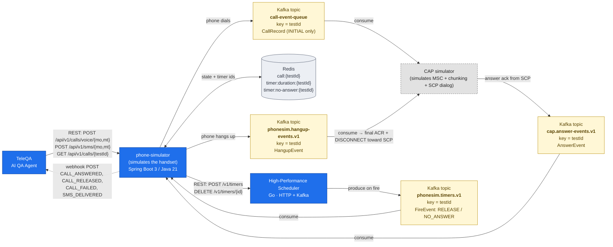
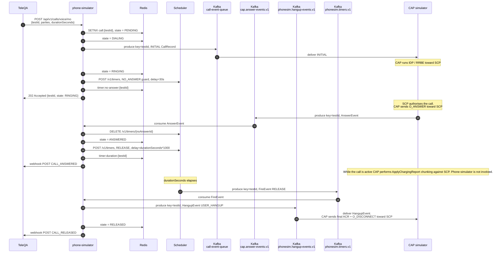
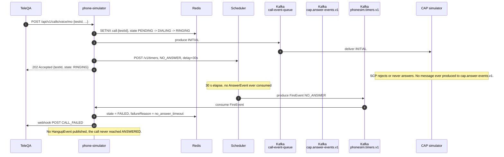

# AI Call Simulator — integration diagram

This document covers how the three TeleQA platform services that have integration contracts on the
phone-simulator side fit together: the **AI QA Agent (TeleQA)**, **phone-simulator**, and the
**High-Performance Scheduler**. The **GSM CAP simulator** is shown alongside as the downstream
consumer of the call-event topic and producer of the answer-event topic; it has no REST surface
of its own — its integration with phone-simulator is purely Kafka-based.

> **Ownership boundary — read this first.**
>
> Phone-simulator simulates the **handset**. Its only outbound signals to the CAP side are:
> 1. *I'm dialling* — `INITIAL` `CallRecord` on the `call-event-queue` topic, exactly once per call.
> 2. *I'm hanging up* — `HangupEvent` on the `phonesim.hangup-events.v1` topic, exactly once per
>    answered call (when the configured `durationSeconds` elapses).
>
> Phone-simulator **never** emits intermediate billing chunks. ApplyChargingReport / ACR /
> `LAST_CHUNK` accounting and the `O_DISCONNECT` toward the SCP are entirely owned by the CAP
> simulator. CAP receives the `HangupEvent` and translates it into the final ACR + DISCONNECT
> dialog with the SCP using its existing internal logic.

> **Identity model:** every voice call and SMS is identified by a caller-supplied `testId`
> (string, `[A-Za-z0-9_-]{1,64}`). The same `testId` is the Redis key, the Kafka message key on
> every topic, the scheduler's timer `partition_key`, the webhook event correlation, and the
> path variable on `GET /api/v1/calls/{testId}`. There is no server-generated id.

---

## 1. Component view



### Edges at a glance

| From | To | Transport | Payload |
|---|---|---|---|
| TeleQA | phone-simulator | HTTPS (REST) | `PlaceVoiceCallRequest` / `PlaceSmsRequest` (testId required) |
| phone-simulator | TeleQA | HTTPS (webhook POST) | `CallEvent` (`CALL_ANSWERED`, `CALL_RELEASED`, `CALL_FAILED`, `SMS_DELIVERED`, `SMS_FAILED`) |
| phone-simulator | CAP simulator | Kafka `call-event-queue` | `CallRecordPayload` JSON, `callState = INITIAL` (only — exactly once per call) |
| CAP simulator | phone-simulator | Kafka `cap.answer-events.v1` | `AnswerEvent {testId, answerType, answeredAt, schemaVersion}` |
| phone-simulator | CAP simulator | Kafka `phonesim.hangup-events.v1` | `HangupEvent {testId, reason, hungUpAt, schemaVersion}` (exactly once per answered call) |
| phone-simulator | Scheduler | HTTPS (REST) | `POST /v1/timers` (`delay_ms`, `kafka_topic`, base64 `payload`), `DELETE /v1/timers/{id}` |
| Scheduler | phone-simulator | Kafka `phonesim.timers.v1` | raw payload bytes — phone-simulator's own `FireEvent {testId, eventType, schemaVersion}` |

---

## 2. Voice MO call lifecycle — happy path



Key invariants:
- The duration timer is only enqueued **after** the `AnswerEvent` is consumed.
  Whatever delay CAP needs between INITIAL and answer is excluded from the visible call duration.
- The no-answer guard is best-effort cancelled on answer; if the cancel races and the guard fires
  on an already-ANSWERED call, the fire path is idempotent and silently exits.
- Phone-simulator publishes **two** Kafka messages per successful call (one INITIAL, one
  HangupEvent). Intermediate chunks during the call are CAP's responsibility.

---

## 3. Voice MO call — no-answer timeout



Threshold is `phonesim.call.no-answer-timeout` (default 30 s). On fire, phone-simulator does
**not** publish a `HangupEvent` — there's no answered call to hang up on the CAP side. CAP's
existing `SimulatorCapListener.onCAPReleaseCall` already handles the SCP-side teardown when the
SCP rejects an unanswered call.

---

## 4. SMS lifecycle (MO/MT) — single-shot

SMS is synchronous and skips the answer-event/hangup/timer paths entirely:

```
PENDING ──► ANSWERED ──► RELEASED
   │
   └──► FAILED   (any IO error)
```

- One Kafka message on `call-event-queue` with `serviceKey=205`, `smsRecord=true`,
  `callState=INITIAL`. **No HangupEvent**, no scheduler interaction.
- Webhook fires `SMS_DELIVERED` (or `SMS_FAILED`) once.

---

## 5. State machine summary

| Kind | Path | Phone-side Kafka publishes |
|---|---|---|
| Voice (happy) | `PENDING → DIALING → RINGING → ANSWERED → RELEASED` | INITIAL on call-event, HangupEvent on hangup-events |
| Voice (no answer) | `PENDING → DIALING → RINGING → FAILED` (`no_answer_timeout`) | INITIAL only |
| Voice (publish/scheduler error) | `PENDING/DIALING/RINGING → FAILED` | none, or INITIAL only |
| SMS | `PENDING → ANSWERED → RELEASED` (or `FAILED`) | INITIAL on call-event |

Allowed transitions are enforced by [`CallStateMachine`](../src/main/java/com/azerconnect/phonesim/domain/CallStateMachine.java);
illegal transitions throw `IllegalStateTransitionException` (mapped to HTTP 409).
